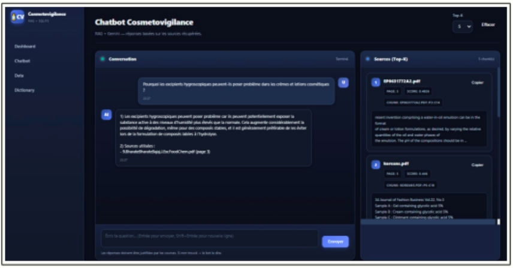

# CosmetoVigilance IA 

> **Plateforme intelligente de surveillance cosmétique** — intégration de données multi-sources, base de données relationnelle, Data Warehouse, pipeline RAG et assistant IA pour la CosmetoVigilance.

---

## Vue d'ensemble

CosmetoVigilance IA est un système end-to-end conçu pour :

| Objectif | Description |
|---|---|
|  Ingestion | Exploiter des données brutes multi-sources (CSV, PDF, Open Data) |
|  Structuration | Construire une base SQLite normalisée pour la CosmetoVigilance |
|  Analyse | Construire un Data Warehouse et un dashboard décisionnel |
|  IA | Développer un assistant capable de répondre à des questions métier |

---

## Pipeline de données


| Traitement | Outil |
|---|---|
| Parsing PDF | PyMuPDF |
| Uniformisation colonnes | pandas |
| Identification entités manquantes | Gemini 1.5 / Qwen (LLM) |
| Correction incohérences | règles métier + LLM |

---

| Table | Description |
|---|---|
| `products` | Produits cosmétiques (marque, catégorie, type de peau, prix) |
| `ingredients` | Dictionnaire INCI normalisé (nom, fonction, catégorie) |
| `product_ingredients` | Relation N:N produits ↔ ingrédients |
| `chemical_incidents` | Données de vigilance (substance, marque, incidents) |

---

| Méthode | Librairie | Usage |
|---|---|---|
| Fuzzy matching | RapidFuzz | Fautes de frappe, variations orthographiques |
| Recherche vectorielle | FAISS + SentenceTransformers | Similarité sémantique |

---


 ## Exemples de questions supportées : Assistant IA — Pipeline RAG 

```
"Quels produits contiennent du Niacinamide ?"
"Quels incidents sont associés à cette marque ?"
"Ce produit convient-il à une peau sensible ?"
"Quelles sont les substances les plus signalées dans les incidents ?"
```

---

## Dashboard

Interface Streamlit (`web/app.py`) avec :

| Module | Fonctionnalité |
|---|---|
| Vue globale | Statistiques produits / ingrédients / incidents |
| Exploration | Filtres, recherche fuzzy, liens produit–ingrédient–incident |
| Visualisation | Graphiques analytiques (top marques, incidents par catégorie…) |
| Assistant IA | Chatbot RAG intégré directement dans le dashboard |

---

## Installation

**Prérequis :** Python 3.10+

```bash
# 1. Cloner le dépôt
git clone https://github.com/votre-user/cosmetovigilance-ia.git
cd cosmetovigilance-ia

# 2. Créer un environnement virtuel
python -m venv .venv
source .venv/bin/activate        # Linux / macOS
.venv\Scripts\activate           # Windows

# 3. Installer les dépendances
pip install -r requirements.txt
```


## Utilisation

```bash
# Pipeline complet (ingestion → nettoyage → base → index)
python main.py --pipeline full

# Lancer uniquement le dashboard
streamlit run web/app.py

# Lancer l'assistant en ligne de commande
python main.py --chat
```

---

## Stack technique

| Couche | Technologie |
|---|---|
| Langage | Python 3.10+ |
| Base de données | SQLite |
| LLM | Google Gemini 1.5 Flash · Qwen |
| Embeddings | SentenceTransformers |
| Index vectoriel | FAISS |
| Fuzzy search | RapidFuzz |
| Parsing PDF | PyMuPDF |
| Dashboard | Streamlit |
| Manipulation données | pandas · numpy |
 ## CHATBOT CosmetoVigilance 
 

> *Projet réalisé dans le cadre d'un cursus IA & Data Warehouse — Décembre 2025 en Équipe*
